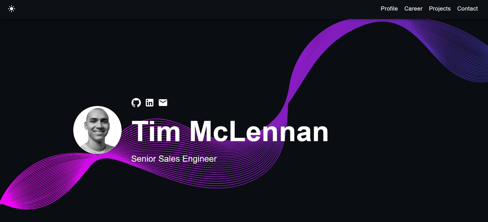

# Tim McLennan - Sales Engineering Portfolio 🚀

   

## About This Portfolio

This portfolio showcases my experience, skills, and achievements as a Sales Engineer. It highlights my technical expertise, customer success stories, and professional journey in the tech industry.

View the [Live Portfolio](https://Tim-Mclennan.github.io/salesengineerportfolio).



## Features

✅ Responsive design & mobile-friendly  
✅ Modern UI with Material-UI components  
✅ Interactive timeline of professional experience  
✅ Skills showcase with visual representations  
✅ Project demonstrations and case studies  
✅ Contact information and social links  

## Technical Stack

- React.js with TypeScript
- Material-UI for modern UI components
- SASS for styling
- React Vertical Timeline Component
- Font Awesome icons

## Local Development

1. Ensure you have [Node.js](https://nodejs.org/) installed. Check your installation by running:

    ```bash
    node -v
    ```

2. Clone this repository and install dependencies:

    ```bash
    git clone https://github.com/Tim-Mclennan/salesengineerportfolio.git
    cd salesengineerportfolio
    npm install
    ```

3. Start the development server:

    ```bash
    npm start
    ```

4. Open [http://localhost:3000](http://localhost:3000) to view the app in the browser.

## Deployment

This portfolio is deployed using GitHub Pages. The deployment is automated through the following process:

1. The `homepage` in `package.json` is set to:
   ```json
   "homepage": "https://Tim-Mclennan.github.io/salesengineerportfolio"
   ```

2. To deploy updates:
   ```bash
   npm run deploy
   ```

## Contact

Feel free to reach out through the contact form on the portfolio or connect with me on LinkedIn.

---

Built with ❤️ using React and TypeScript